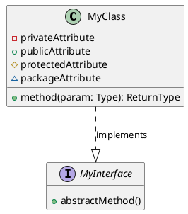
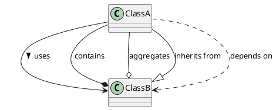
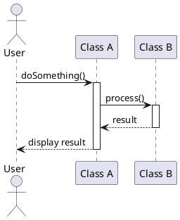
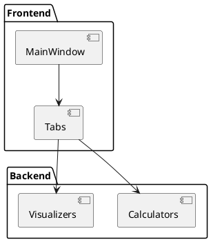
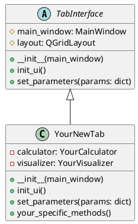
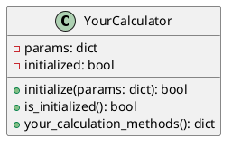

# UML Quick Reference for RIXS Preparation Toolbox

This cheatsheet provides a quick reference for the UML notations most relevant to our project.

## Class Diagram Notation

```
┌───────────────────────┐
│      ClassName        │
├───────────────────────┤
│ - privateAttribute    │
│ + publicAttribute     │
├───────────────────────┤
│ + publicMethod()      │
│ - privateMethod()     │
└───────────────────────┘
```

### Relationships

```
ClassA ────────> ClassB     Association: ClassA uses ClassB
ClassA ◆────────> ClassB     Composition: ClassB is part of ClassA
ClassA ○────────> ClassB     Aggregation: ClassB is used by ClassA
ClassA ────────|> ClassB     Inheritance: ClassA inherits from ClassB
ClassA - - - -> ClassB     Dependency: ClassA depends on ClassB
```

## Sequence Diagram Notation

```
┌───┐          ┌───┐
│ A │          │ B │
└─┬─┘          └─┬─┘
  │              │
  │─────────────>│  Method call
  │              │
  │<- - - - - - -│  Return value
  │              │
  │──┐           │
  │  │ Self call │
  │<─┘           │
  │              │
```

## Component Diagram Notation

```
┌─────────────────┐       ┌─────────────────┐
│                 │       │                 │
│   Component A   │───────│   Component B   │
│                 │       │                 │
└─────────────────┘       └─────────────────┘
```

## PlantUML Quick Reference

### Class Diagram



### Relationships



### Sequence Diagram



### Component Diagram



## Standard Tab Interface in Our Project

All new tabs should implement this interface:



## Standard Calculator Interface

All calculators should implement this interface:



## Key Points to Remember

1. **Return Dictionaries**: All calculation methods should return dictionaries with at least:
   ```python
   {
       'success': bool,
       'error': str,  # Only if success is False
       # Other result data...
   }
   ```

2. **Standard Parameter Format**: Use consistent parameter structure:
   ```python
   params = {
       'lattice': {
           'a': float,
           'b': float,
           'c': float,
           'alpha': float,
           'beta': float,
           'gamma': float
       },
       'energy': float,
       # Other parameters...
   }
   ```

3. **Visualization Methods**: Always include options for axis and clearing:
   ```python
   def visualize_something(self, data, ax=None, clear=True):
       # Implementation
   ``` 