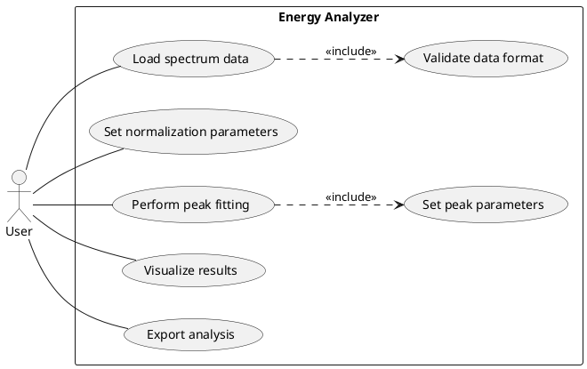
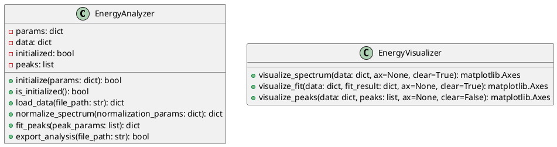
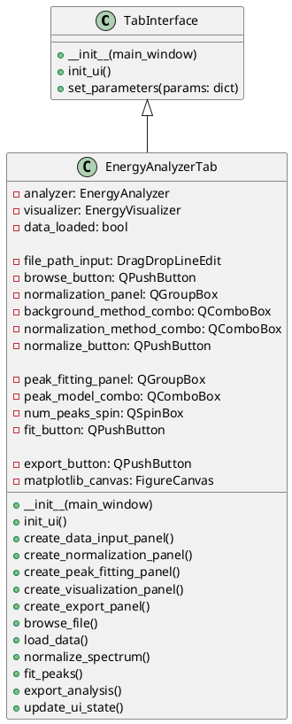
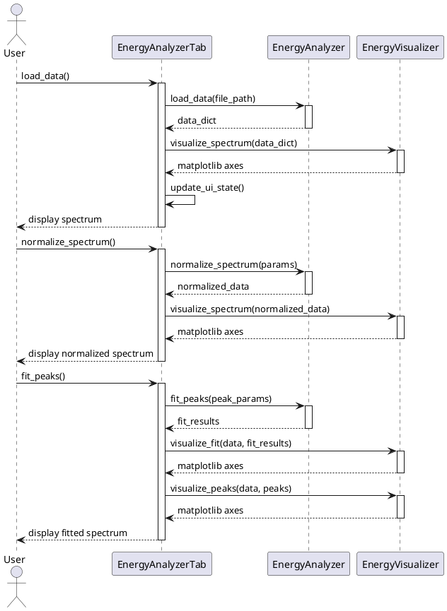

# Example: Creating a New Feature with UML

This document walks through the complete process of designing and implementing a new feature for the RIXS Preparation Toolbox using UML.

## Feature: Energy Analyzer

Let's imagine we want to add a new feature that allows users to analyze energy spectra.

## Step 1: Requirements Specification

```
Feature: Energy Analyzer
Description: Tool for analyzing energy spectra from RIXS experiments
Inputs: Energy spectrum data file, normalization parameters
Outputs: Normalized spectra, peak fitting results, exported analysis
User actions: Load data, set parameters, perform analysis, visualize results, export
```

## Step 2: Use Case Diagram



## Step 3: Class Diagrams

### Backend Class Diagram



### Frontend Class Diagram



## Step 4: Sequence Diagram for Core Functionality



## Step 5: Interface Specification

### EnergyAnalyzer Interface

```python
class EnergyAnalyzer:
    def initialize(self, params):
        """
        Initialize the analyzer with parameters.
        
        Args:
            params (dict): Parameters from the main application
            
        Returns:
            bool: True if initialization succeeded
        """
        
    def is_initialized(self):
        """
        Check if the analyzer is initialized.
        
        Returns:
            bool: True if initialized
        """
        
    def load_data(self, file_path):
        """
        Load data from a file.
        
        Args:
            file_path (str): Path to the data file
            
        Returns:
            dict: {
                'success': bool,
                'data': numpy.ndarray,  # 2D array [energy, intensity]
                'metadata': dict,  # File metadata
                'error': str  # Error message if success is False
            }
        """
        
    def normalize_spectrum(self, normalization_params):
        """
        Normalize the loaded spectrum.
        
        Args:
            normalization_params (dict): {
                'background_method': str,  # 'linear', 'polynomial', 'shirley'
                'background_params': dict,  # Method-specific parameters
                'normalization_method': str,  # 'area', 'max', 'reference'
                'normalization_value': float  # Value to normalize to
            }
            
        Returns:
            dict: {
                'success': bool,
                'original_data': numpy.ndarray,
                'background': numpy.ndarray,
                'normalized_data': numpy.ndarray,
                'normalization_params': dict,  # Params used
                'error': str  # Error message if success is False
            }
        """
        
    def fit_peaks(self, peak_params):
        """
        Fit peaks to the normalized spectrum.
        
        Args:
            peak_params (list): List of peak parameter dicts
                Each dict: {
                    'model': str,  # 'gaussian', 'lorentzian', 'voigt'
                    'position': float,  # Initial position guess
                    'amplitude': float,  # Initial amplitude guess
                    'width': float,  # Initial width guess
                    'bounds': dict  # Parameter bounds
                }
                
        Returns:
            dict: {
                'success': bool,
                'fit_result': dict,  # Fitting statistics
                'peaks': list,  # List of fitted peak parameters
                'fitted_curve': numpy.ndarray,  # Complete fitted curve
                'components': list,  # Individual peak components
                'error': str  # Error message if success is False
            }
        """
        
    def export_analysis(self, file_path):
        """
        Export analysis results to a file.
        
        Args:
            file_path (str): Path to export to
            
        Returns:
            bool: True if export succeeded
        """
```

## Step 6: Implementation Plan

1. **Directory Structure**:
   ```
   packages/
   ├── energy_analyzer/
   │   ├── __init__.py
   │   ├── interface.py  # Contains EnergyAnalyzer
   │   └── visualization.py  # Contains EnergyVisualizer
   └── gui/
       └── tabs/
           └── energyanalyzertab.py  # Contains EnergyAnalyzerTab
   ```

2. **Development Tasks**:

   **Backend Developer**:
   - Implement `EnergyAnalyzer` class in `interface.py`
   - Implement `EnergyVisualizer` class in `visualization.py`
   - Write unit tests for analyzer functionality
   
   **Frontend Developer**:
   - Implement `EnergyAnalyzerTab` class in `energyanalyzertab.py`
   - Create UI layout with appropriate widgets
   - Connect UI actions to backend methods
   
   **Integration**:
   - Add tab to registry in `config/tab_registry.json`
   - Test integration with sample data

## Step 7: Review and Refine

After implementing a first version, review the design and update the UML diagrams based on what was learned during implementation.

## Conclusion

This example demonstrates how UML can help plan and coordinate the development of a new feature. By clearly defining the interfaces and behaviors upfront, frontend and backend developers can work independently but still produce components that work well together.

The UML diagrams serve as a shared understanding of the feature's structure and behavior, making collaboration more efficient.