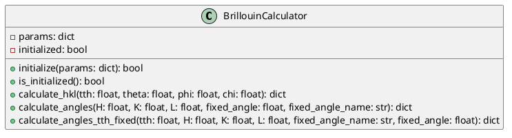
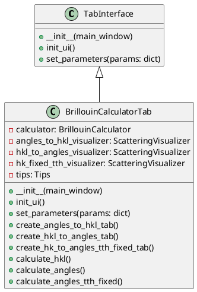
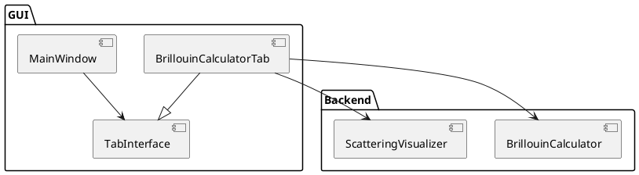
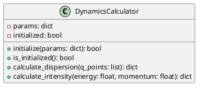
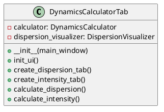

# UML Guide for RIXS Preparation Toolbox Collaboration

## Introduction

This guide will help you use Unified Modeling Language (UML) to collaborate effectively with your teammates on the RIXS Preparation Toolbox. UML is a standardized modeling language that provides a way to visualize the design of a system.

## Table of Contents

1. [UML Basics](#uml-basics)
2. [Relevant UML Diagrams for Our Project](#relevant-uml-diagrams-for-our-project)
3. [Step-by-Step Guide](#step-by-step-guide)
4. [Tools for UML Modeling](#tools-for-uml-modeling)
5. [Collaboration Workflow](#collaboration-workflow)
6. [Examples Based on Existing Code](#examples-based-on-existing-code)

## UML Basics

UML consists of various diagram types that represent different aspects of a system. For our project, we'll focus on:

- **Class Diagrams**: Show classes, their attributes, methods, and relationships
- **Component Diagrams**: Illustrate how components are wired together to form larger components or software systems
- **Sequence Diagrams**: Display object interactions arranged in time sequence
- **Use Case Diagrams**: Depict user interactions with the system

## Relevant UML Diagrams for Our Project

### Class Diagrams

Most useful for our project since we have clear separation between frontend (GUI tabs) and backend (calculators and visualizers).

**When to use**: 
- Designing new calculators or visualizers
- Planning tab interfaces
- Understanding relationships between existing classes

### Component Diagrams

Helpful for showing how different modules of our application interact.

**When to use**:
- Planning new modules
- Understanding dependencies between components

### Sequence Diagrams

Good for visualizing the flow of operations between frontend and backend.

**When to use**:
- Designing user interaction flows
- Understanding complex calculations or visualization processes

## Step-by-Step Guide

### 1. Analyze Existing Structure

Before creating UML diagrams, understand our current application structure:

- **Frontend**: `packages/gui/` contains the tab interfaces 
- **Backend**: 
  - `packages/brillouin_calculator/` is an example calculator
  - `packages/visualizer/` contains visualizer components

### 2. Create Class Diagrams for Existing Components

Start with class diagrams for existing components to understand their structure:

1. Create a class diagram for `BrillouinCalculator` from `packages/brillouin_calculator/interface.py`
2. Create a class diagram for `BrillouinCalculatorTab` from `packages/gui/tabs/brillouincalculatortab.py`
3. Create a class diagram for visualizers in `packages/visualizer/`

### 3. Design New Components

When adding a new feature (e.g., a new calculator with corresponding tab):

1. Create a class diagram for the new calculator/visualizer showing:
   - Attributes
   - Methods
   - Relationships with existing classes
   
2. Create a class diagram for the new tab showing:
   - UI components
   - Methods for handling user interaction
   - Relationship with the backend

### 4. Create Interface Specifications

For collaboration, define clear interfaces between frontend and backend:

1. List methods the backend must provide
2. Define data structures for communication
3. Document expected behavior

## Tools for UML Modeling

Several tools are available for UML modeling:

1. **Free Options**:
   - [draw.io](https://app.diagrams.net/) (online and desktop)
   - [UMLet](https://www.umlet.com/) (simple, lightweight)
   - [PlantUML](https://plantuml.com/) (text-based, good for version control)

2. **Paid Options**:
   - [Lucidchart](https://www.lucidchart.com/)
   - [Visual Paradigm](https://www.visual-paradigm.com/)
   - [Enterprise Architect](https://sparxsystems.com/)

For our project, **PlantUML** is recommended because:
- Text-based format works well with git
- Can be embedded in markdown
- Doesn't require special software

## Collaboration Workflow

Here's a suggested workflow for using UML in our collaborative development:

1. **Requirements Analysis**
   - Create use case diagrams to identify what the new feature should do

2. **Design Phase**
   - Create class diagrams for both frontend and backend
   - Define interfaces between components
   - Create sequence diagrams for complex interactions

3. **Task Distribution**
   - Assign frontend and backend tasks based on diagrams
   - Each team member can work with clear understanding of interfaces

4. **Implementation**
   - Developers refer to UML diagrams during coding
   - Update diagrams if design changes

5. **Integration**
   - Use diagrams to verify proper implementation

## Examples Based on Existing Code

### Class Diagram Example: BrillouinCalculator

### Class Diagram Example: Frontend Tab

### Component Diagram Example

## Creating a New Tab and Calculator

Here's how to plan a new feature using UML:

1. **Create a use case diagram** to identify what the feature should do
2. **Create class diagrams** for:
   - The new calculator (backend)
   - The new visualizer (if needed)
   - The new tab (frontend)
3. **Create a component diagram** showing how the new components fit into the existing system
4. **Create sequence diagrams** for any complex interactions

### Example: Planning a New DynamicsCalculator and Tab

1. First, define the calculator interface:

2. Then, define the tab interface:

## Conclusion

UML diagrams provide a powerful way to plan and communicate design ideas. By using UML before implementation:

1. Team members have a clear understanding of their tasks
2. Interfaces between components are well-defined
3. Integration is smoother because everyone knows how the parts fit together

Start with simple diagrams and add detail as needed. The goal is to communicate effectively, not to create perfect diagrams. 