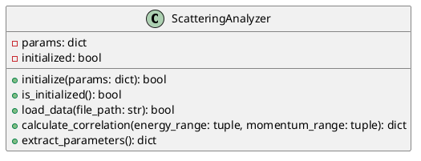
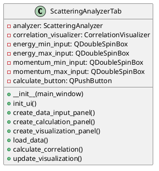
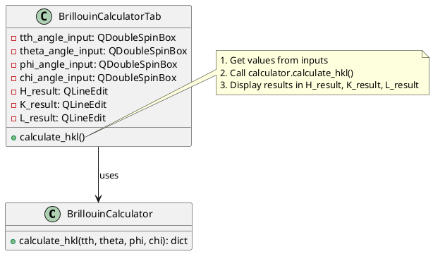

# UML Collaboration Workflow for RIXS Preparation Toolbox

This document outlines a practical workflow for using UML to collaborate on new features for the RIXS Preparation Toolbox.

## Quick Start Guide

### Step 1: Define the Feature Requirements

1. Create a simple text document describing:
   - What the feature should do
   - What inputs it takes
   - What outputs it produces
   - Any special behavior or constraints

2. Example for a new "Scattering Analyzer" feature:
   ```
   Feature: Scattering Analyzer
   Description: Analyzes scattering data and calculates correlation functions
   Inputs: Scattering data file (.dat format), energy range, momentum range
   Outputs: Correlation function plot, extracted parameters
   ```

### Step 2: Create Basic UML Diagrams

#### For the Backend Developer:

1. Create a class diagram for the calculator:



2. Define the interface methods with clear documentation:

```python
def calculate_correlation(self, energy_range, momentum_range):
    """
    Calculate correlation function from loaded data.
    
    Args:
        energy_range (tuple): (min_energy, max_energy) in eV
        momentum_range (tuple): (min_momentum, max_momentum) in Å^-1
    
    Returns:
        dict: {
            'success': bool,
            'correlation': numpy.ndarray,  # 2D array of correlation values
            'energy_axis': numpy.ndarray,  # 1D array of energy points
            'momentum_axis': numpy.ndarray,  # 1D array of momentum points
            'error': str  # Error message if success is False
        }
    """
    pass
```

#### For the Frontend Developer:

1. Create a class diagram for the tab:



### Step 3: Collaboration Setup

1. Create a shared document (e.g., in a Git repository under `documents/`) containing:
   - The requirements
   - The UML diagrams
   - Agreed interface specifications

2. Set up the basic file structure:

```
packages/
├── scattering_analyzer/
│   ├── __init__.py
│   ├── interface.py  # Contains the ScatteringAnalyzer class
│   └── visualization.py  # Contains visualization utilities
└── gui/
    └── tabs/
        └── scatteringanalyzertab.py  # Contains the tab UI
```

### Step 4: Implementation

1. Backend developer implements:
   - `interface.py` with all methods defined in the class diagram
   - Tests to verify functionality

2. Frontend developer implements:
   - `scatteringanalyzertab.py` with the UI elements
   - Connection to the backend via the defined interface

### Step 5: Integration

1. Create a registry entry in `config/tab_registry.json`:

```json
{
  "tabs": [
    {
      "name": "Scattering Analyzer",
      "module_package": "scattering_analyzer",
      "tab_class": "ScatteringAnalyzerTab",
      "icon": "icons/scattering_analyzer.png",
      "description": "Analyze scattering data and calculate correlation functions",
      "enabled": true,
      "order": 3
    }
  ]
}
```

2. Test the integration with simulated data

## Best Practices for UML in Our Project

1. **Keep It Simple**
   - Focus on key methods and attributes
   - Don't try to document every detail

2. **Be Consistent with Naming**
   - Follow the pattern of existing modules
   - Use similar method names for similar functionality

3. **Update Diagrams When Changes Occur**
   - If the implementation differs from the design, update the UML
   - Store UML files in version control

4. **Include Examples with Diagrams**
   - Show example method calls and return values
   - Clarify complex interactions with sequence diagrams

## Practical Example: BrillouinCalculator Interface

Here's a simplified real-world example based on your existing code:



## Conclusion

Using UML diagrams helps everyone understand the structure and relationships in the code. For our project, the most important aspects are:

1. Clearly defined interfaces between frontend and backend
2. Consistent naming and patterns across components
3. Clear documentation of inputs and outputs

By following this workflow, we can collaborate effectively even when working on different parts of the codebase simultaneously. 